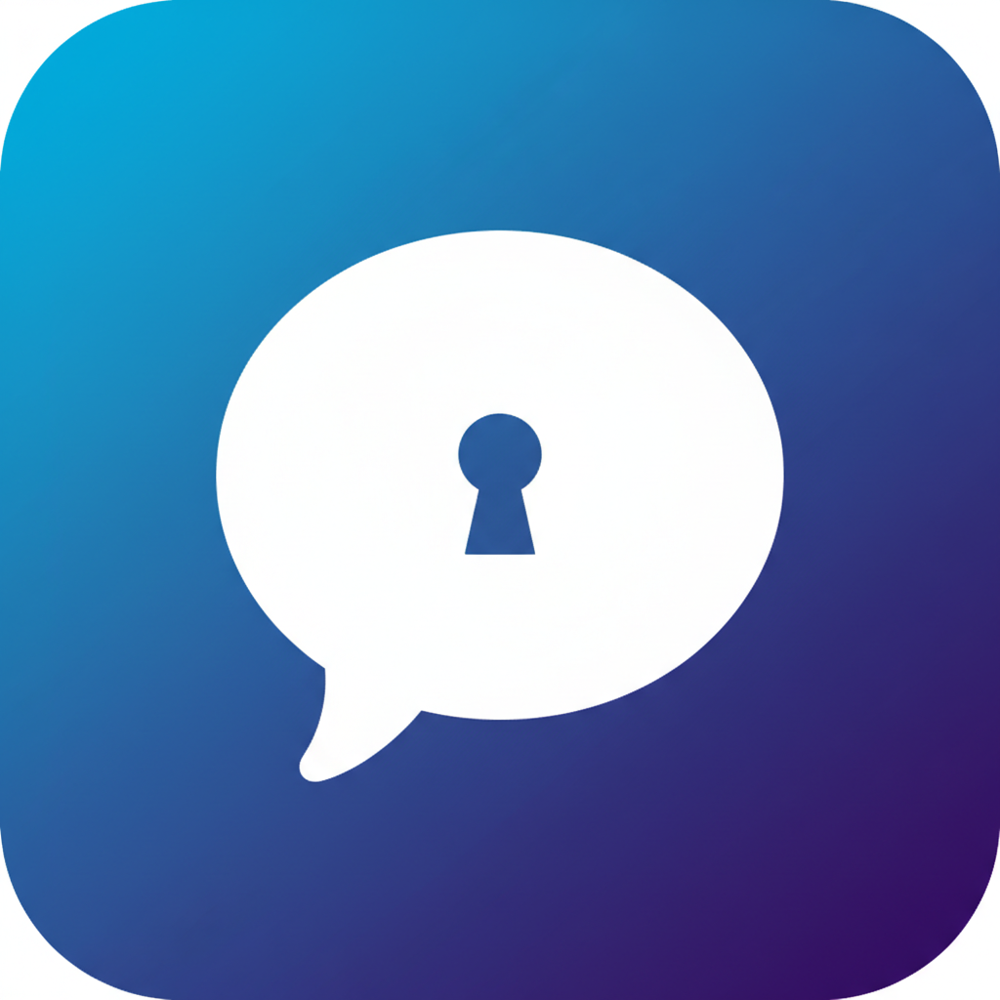
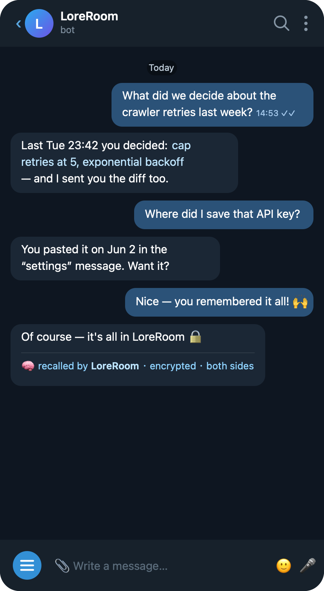

<p align="center">
  
</p>

<h1 align="center">LoreRoom</h1>

<p align="center"><em>Your Claude Code Telegram bot — but it remembers.</em></p>

<p align="center">
  
</p>

> 中文版 → [README.zh-TW.md](./README.zh-TW.md)

**A private, encrypted room that remembers every conversation with your Claude Code Telegram bot — both sides — so it never forgets.**

You chat with Claude Code from your phone through the official Telegram plugin. But every Claude Code session is amnesiac: restart it and the whole conversation is gone. LoreRoom captures both sides of that Telegram conversation into a single, whole-file-encrypted SQLite database and hands it back to Claude as searchable memory.

So you can ask your bot:

> **You:** what did I ask you to do last night?
> **Bot:** *(searches LoreRoom)* You asked me to fix the crawler retry logic and send you the diff…

Local-first. No cloud, no extra API keys, it never touches your bot token.

---

## Why LoreRoom exists (and why it's reliable)

The Claude Code Telegram plugin delivers your incoming messages to Claude through an internal channel push — **not** through any hook. Worse, when Claude is busy those messages **queue invisibly**, and if the bot never replies they're simply gone. So the obvious approaches (hooks, reading the transcript) silently lose your messages.

LoreRoom captures at the **plugin's source**, the instant a message arrives from Telegram:

- **Inbound** — the moment Telegram delivers it, *before* any queue, *regardless of whether Claude is busy, crashed, or never replies*.
- **Outbound** — whenever the bot sends a reply.

Both are written to a small spool file that an ingester drains into the encrypted database. **Nothing is lost — even when your bot is unresponsive.** (Messages that were stuck while the bot was busy get captured the moment it restarts and re-fetches them.)

No Claude Code hooks are used, so LoreRoom never interferes with your other Claude Code work.

```
You ⇄ Telegram ──(patched plugin)──> spool ──(ingester)──> encrypted SQLite (SQLCipher + FTS5)
                  captures in + out      drained on a timer        ▲
                                                                   │ MCP server
                                                          get_recent_context · search_tg_history
                                                                   │
                                                            Claude recalls — both sides, with time & sender
```

## Before you start — what you need

LoreRoom adds memory to an **existing** Claude Code Telegram bot. So you first need that bot working. **If you can already chat with your bot from Telegram, skip to [Install](#install).** Otherwise, set this up once (~5 minutes):

**1. Node.js 20 or newer.** Check with `node -v`. If missing, get it from [nodejs.org](https://nodejs.org).

**2. Claude Code** — Anthropic's command-line tool. See the [install guide](https://docs.claude.com/en/docs/claude-code).

**3. A Telegram bot connected to Claude Code:**
   1. In Telegram, open a chat with **@BotFather**, send `/newbot`, follow the prompts, and copy the **bot token** it gives you (a long string).
   2. In Claude Code, install the official **Telegram plugin**, then configure it with your token: `/telegram:configure <your-bot-token>`.
   3. Link your account: send your bot any message in Telegram — it replies with a pairing code — then run `/telegram:access pair <code>` in Claude Code.
   4. Start a bot session: `claude --channels plugin:telegram@claude-plugins-official`, then send your bot "hi" in Telegram. It should reply.

Once "hi" gets a reply, your bot works. Now give it memory with LoreRoom 👇

> **Scope:** LoreRoom only works with Claude Code + the official Telegram plugin (it is not a general Telegram bot framework). It captures by **patching the plugin** — one idempotent command you re-run after plugin updates. See [Why patch the plugin](#why-patch-the-plugin).

## Install

```bash
git clone https://github.com/fenghaochang/LoreRoom.git && cd LoreRoom
npm install
npm run build
node dist/cli.js init        # creates config.json + a fresh encryption key, prints the next steps
node dist/patch-plugin.js    # patches the Telegram plugin to capture in + out
# register the recall server (it also auto-drains the spool):
claude mcp add --scope user loreroom -- "$(command -v node)" "$PWD/dist/mcp-server.js"
```

Then **restart your bot session** (`claude --channels …`) so it loads the patched plugin. Done — every Telegram message is now captured automatically.

> **Node version note:** the encrypted-SQLite native module is ABI-bound to one Node version, and `init` pins the exact `node` that ran it. If you later upgrade or remove that Node, re-run `npm install && npm run build` and re-register.

## Verify

1. Send your bot a message on Telegram.
2. Ask Claude (in any session) to call `get_recent_context` with `hours: 1` — you'll see your message with the correct time and sender, **even if the bot never replied**.
3. Ask it to `search_tg_history` for a keyword from that message — it comes back.

## How you use it day to day

Nothing to do — that's the point. Once it's set up, **just chat with your bot normally.** Every message, both yours and the bot's, is saved automatically.

When you want it to remember something, just ask in plain language:

> "what did we decide about the database yesterday?"
> "what did I send you last night?"
> "find where I mentioned the API key"

The bot searches its own memory and answers. You never run a command — it calls the search tools for you behind the scenes.

Two things to keep in mind:
- Keep a bot session running (`claude --channels …`). If it stops, restart it — messages that arrived while it was down are captured when it comes back.
- After you **update the Telegram plugin**, re-run `node dist/patch-plugin.js` once to re-apply the patch (it's a no-op if already patched).

## Why patch the plugin

There is no hook and no on-disk record for inbound Telegram messages, so the only reliable capture point is inside the plugin itself. The patch is tiny — a helper plus two one-line calls at the plugin's inbound and outbound choke points — and **idempotent** (running it twice is a no-op). Plugin updates overwrite it, so re-run `node dist/patch-plugin.js` after an update.

## Self-contained

Everything LoreRoom owns lives **inside this project folder**:

- `config.json` — your settings + encryption key (git-ignored, `chmod 600`, created by `init`)
- `data/memory.sqlite` — the encrypted database (git-ignored)

The spool is a short-lived plaintext file in the plugin's own `~/.claude/channels/telegram/` state dir (mode `0700`), drained continuously and deleted.

## Configuration (`config.json`)

| Key | Meaning |
| --- | --- |
| `dbPath` | DB location. Relative paths resolve inside the project (default `data/memory.sqlite`). |
| `encryptionKey` | 64-char hex (32 bytes). `node -e "console.log(require('crypto').randomBytes(32).toString('hex'))"`. |
| `spoolPath` | Spool the plugin writes (default `~/.claude/channels/telegram/loreroom-spool.jsonl`; must match the plugin state dir). |
| `capture.chatAllow` / `chatDeny` / `skipPatterns` | Optional filters. Default `[]` = capture everything (both sides, including repeated/automated messages). |

## Draining the spool

The MCP server drains on startup, every 20s, and before each query — so whenever any Claude Code session is open, capture flows into the DB automatically. For draining independent of sessions:

```bash
node dist/cli.js ingest   # drain once
node dist/cli.js watch    # drain continuously (good for launchd/cron)
```

## MCP tools Claude can call

- `get_recent_context({ hours, chat_id? })` — messages from the last N hours.
- `search_tg_history({ keyword, chat_id? })` — full-text search across all history (FTS5 trigram, works for CJK; LIKE fallback for short keywords).

Both return each hit with timestamp, sender, role, chat id, and text.

## Security & encryption boundary

- LoreRoom **never handles your Telegram bot token** — that belongs to the plugin. There is no token to leak here.
- The only secret is the **32-byte encryption key** in `config.json` (git-ignored, `chmod 600`) — never committed, never logged.
- The database is **encrypted as a whole file** (SQLCipher / AES-256). Copying `data/memory.sqlite` to another machine is useless without the key.
- **This is at-rest encryption of the local DB — NOT Telegram end-to-end encryption.** It changes nothing about Telegram itself. Decryption happens only locally, in LoreRoom's own processes; the key is never given to Claude and never crosses a network.
- **Protects against:** the DB file being copied off the machine / a backup leak. **Does not protect against:** someone who can already read your account's files on this machine (the key sits next to the DB by design). The spool is briefly plaintext until drained.

## Limitations

- Requires patching the official Telegram plugin (re-apply after plugin updates via `patch-plugin`).
- Keyword + time recall only — no semantic / vector RAG yet (a future `sqlite-vec` layer could add it without breaking the single-file design).
- Messages sent to Telegram by a separate script (not through the plugin's reply path) aren't captured.
- Tested on macOS with Node 26 and the plugin running under bun; other setups may need tweaks.

## License

MIT
